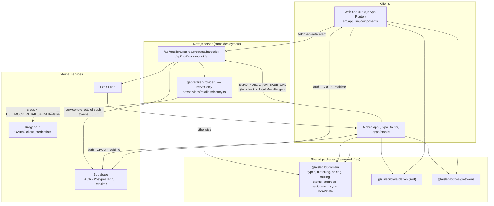
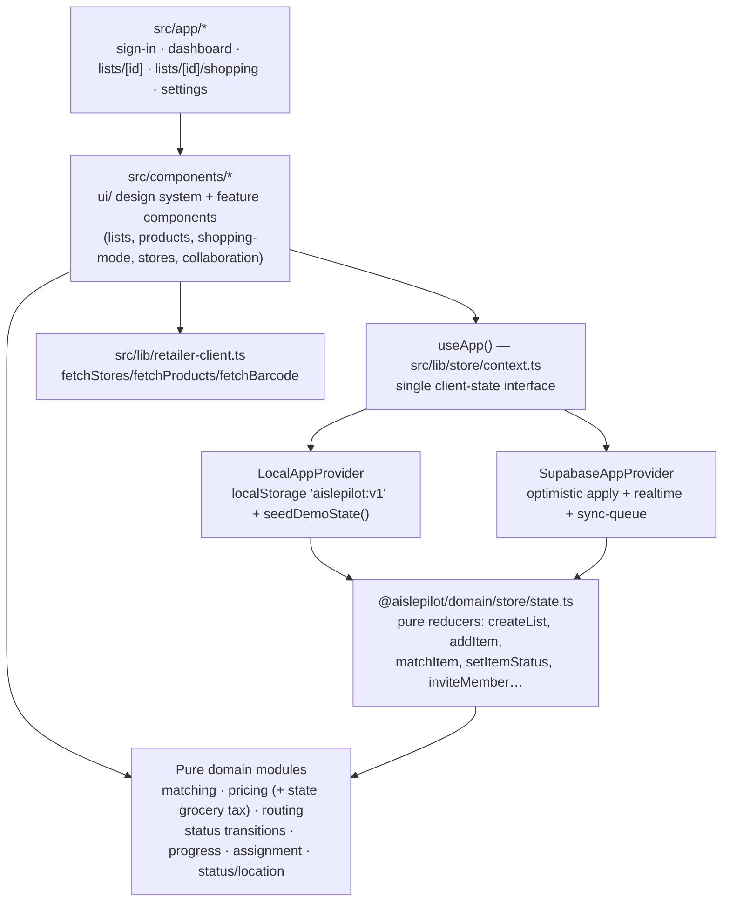
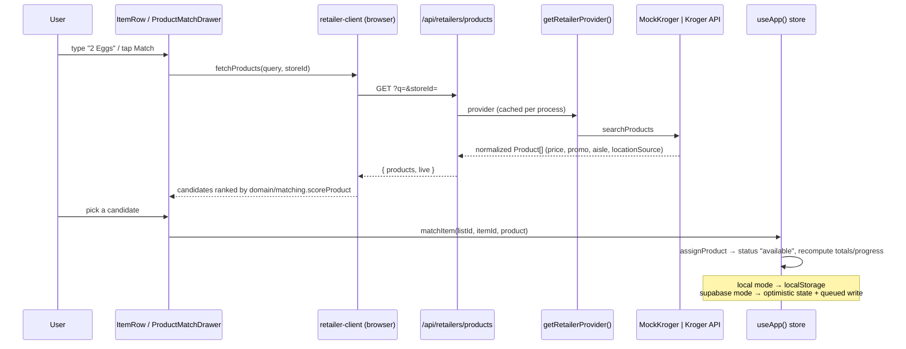
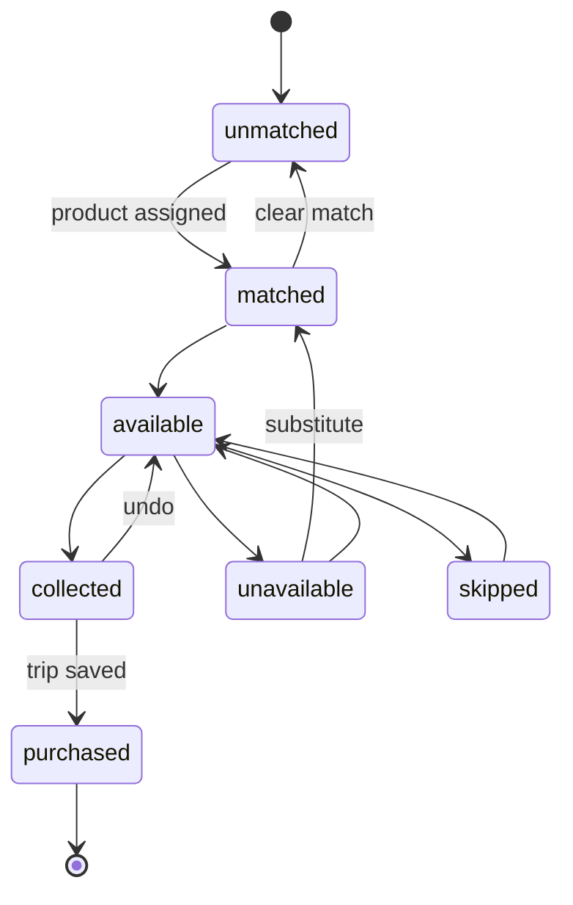
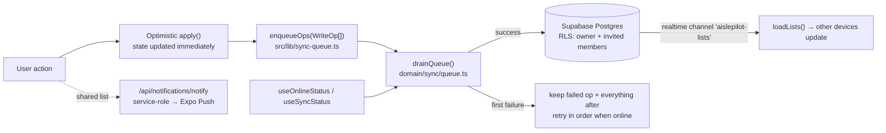
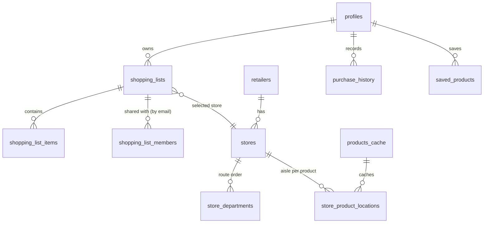

# AislePilot — how it works

Monorepo (npm workspaces): a Next.js 14 App Router web app at the root (`src/`),
an Expo/React Native app (`apps/mobile`), and three shared packages
(`packages/domain`, `packages/validation`, `packages/design-tokens`).

Two independent "backend switches" define every runtime mode:

| Switch | Off (default) | On |
|---|---|---|
| Persistence/auth (`NEXT_PUBLIC_SUPABASE_*`) | `LocalAppProvider` — localStorage + seeded demo account | `SupabaseAppProvider` — Postgres + Auth + Realtime, durable write queue |
| Retailer data (`KROGER_*` + `USE_MOCK_RETAILER_DATA=false`) | `MockKrogerProvider` — fictional stores/catalog | `KrogerProvider` — OAuth client-credentials, live Locations/Products |

Both switches are resolved behind one interface each (`AppContextValue`,
`RetailerProvider`), so no UI component knows which mode it's in.

## 1. System overview

Credentials never reach a client bundle: Kroger secrets are read only inside
`factory.ts` (marked `import "server-only"`), and the service-role key only in
`/api/notifications/notify`.

## 2. Layers inside the repo

`state.ts` is side-effect-free, so both providers (and, in principle, the mobile
store) apply the exact same transitions; persistence is the only difference.

## 3. Matching an item to a product (core flow)

Aisle honesty is carried end-to-end via `locationSource`; only
`retailer_verified` renders as verified (`domain/status/location.ts`), everything
else is labelled an estimate.

## 4. Item status machine (`domain/status`)

Shopping Mode drives these transitions (collect / skip / unavailable /
substitute); `computeProgress` counts everything except `unmatched` as active,
and `resolved/total` is the progress bar.

## 5. Supabase mode: writes, offline queue, realtime

`drainQueue` stops at the first failure so ops never apply out of order (an item
update can't land before the insert that created it).

## 6. Data model (Supabase, `supabase/migrations`)

RLS scopes every list to its owner plus invited members; a trigger creates a
`profiles` row on sign-up.

## Known gaps

- `/api/notifications/notify` reads `device_push_tokens` and cites
  `supabase/migrations/0003_push_tokens.sql`, but only `0001_init.sql` and
  `0002_rls.sql` exist in the repo — push notifications will fail against a fresh
  schema push.
- Mobile has no mock-mode fallback for auth/lists (it shows a "Supabase not
  configured" screen), while retailer data still works fully offline.
- Tests: 18 Vitest files (unit + integration) plus two Playwright e2e specs.
